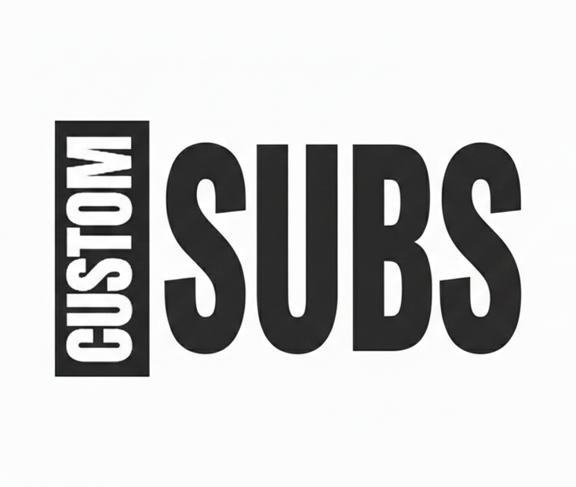

# CustomSubs - Privacy-First Subscription Tracker

<div align="center">
  

  A beautiful, privacy-first subscription tracker for iOS and Android.

  **No accounts • No cloud sync • No tracking • 100% offline**
</div>

## Overview

CustomSubs is a mobile application designed to help you track and manage your subscriptions with complete privacy. All your data stays on your device — no servers, no accounts, no tracking, no internet connection required.

**🎉 Status:** ✅ **LIVE ON APP STORE**

**🆕 Latest Version (v1.4.0 Build 44):** Brand icons for 80+ services, compact paywall redesign, "Later" section for subscriptions 30–90 days out, notification deep linking, and critical v1.4.1 bug fixes.

**💎 Premium Features:** Free tier supports a limited number of subscriptions. Upgrade for unlimited tracking with a 3-day free trial — cancel anytime! Just $0.99/month.

---

### Key Features

**Subscription Tracking:**
- ➕ Add/Edit subscriptions with **260+ pre-populated templates**
- 🎨 Color customization with 12 vibrant colors
- 🎯 **Brand icons** — ~80 popular services display recognizable icons (Netflix, Spotify, Apple Music, etc.)
- 💰 Multi-currency support (30+ currencies with bundled exchange rates)
- 📅 Multiple billing cycles (weekly, biweekly, monthly, quarterly, biannual, yearly)
- 🎁 Free trial tracking with post-trial amount and trial-specific reminders
- ⏸️ **Pause / Snooze** — temporarily pause a subscription; billing dates freeze while paused, auto-resume on a set date

**Notifications:**
- 🔔 Smart notification system with timezone support
- Reminders at 7 days, 1 day, and day-of billing (fully configurable)
- Trial ending reminders (3 days, 1 day, day-of)
- Rich notification actions — "Mark as Paid" and "View Details" directly from the notification
- Deep linking from notification tap to subscription detail screen
- 🧪 Test notification feature so users can verify delivery

**Home Screen:**
- 🏠 Spending summary with animated monthly total
- **Upcoming** section (0–30 days) — sorted by billing date, unpaid first
- **Later** section (30–90 days) — subscriptions coming up in the next quarter
- **Paused** section — paused subscriptions with resume date info
- Swipe left to delete; swipe right to mark as paid
- Pull-to-refresh with automatic billing date advancement

**Cancellation Management:**
- 📋 Cancellation URLs, phone numbers, and freeform notes
- Interactive step-by-step cancellation checklists with progress tracking
- 🌐 Launch cancel URLs and phone numbers directly

**Settings & Data Safety:**
- 💱 Currency picker (30+ currencies with search)
- ⏰ Default reminder time configuration
- 💾 **Backup and restore** (export to JSON, share to Files/email/cloud)
- 🔄 Import with duplicate detection
- ⏰ Backup reminders (after 3rd subscription)
- 🗑️ Delete all data with double confirmation

**Analytics:**
- 📈 Yearly spending forecast (hero metric)
- 📊 Category breakdown with horizontal bar charts
- 🏆 Top 5 subscriptions ranking
- 💱 Multi-currency breakdown

**Premium / IAP:**
- 💎 Freemium model — free tier with subscription limit
- 💳 Premium ($0.99/month): unlimited subscriptions
- 🎁 3-Day Free Trial via StoreKit
- 🏆 Premium badge on home screen
- 🔄 Restore purchases support
- Dynamic pricing and trial display from StoreKit (no hardcoded values)

---

## Screenshots

[Coming soon]

---

## Technology Stack

| Area | Technology |
|------|-----------|
| Framework | Flutter (latest stable) |
| Language | Dart 3.x |
| State Management | Riverpod with code generation (`@riverpod`) |
| Local Database | Hive (NoSQL, on-device) |
| Navigation | GoRouter |
| Notifications | `flutter_local_notifications` + `timezone` |
| Brand Icons | `simple_icons` (3,270 brands, font-based, offline) |
| Charts | `fl_chart` |
| IAP / Premium | RevenueCat (`purchases_flutter` 9.x) |
| Design | Material 3 with custom DM Sans theme |

---

## Architecture

CustomSubs follows clean architecture principles with a feature-first folder structure:

```
lib/
├── app/              # App-level configuration (theme, router)
├── core/             # Shared utilities, constants, extensions, widgets
├── data/             # Data layer (models, repositories, services)
└── features/         # Feature modules (onboarding, home, add, detail, etc.)
```

For detailed architecture documentation, see [Architecture Overview](docs/architecture/overview.md).

---

## Getting Started

**📖 Complete Setup Guide**: See [docs/guides/development-setup.md](docs/guides/development-setup.md) for comprehensive setup instructions including Claude Code configuration.

### Prerequisites

- Flutter SDK 3.24.0 or higher
- Dart SDK 3.5.0 or higher
- iOS development: Xcode 14+ (macOS)
- Android development: Android Studio with SDK 21+

### Installation

1. **Clone the repository**
   ```bash
   git clone <repository-url>
   cd customsubs
   ```

2. **Install dependencies**
   ```bash
   flutter pub get
   ```

3. **Generate code**
   ```bash
   dart run build_runner build --delete-conflicting-outputs
   ```

4. **Run the app**
   ```bash
   flutter devices          # List available devices
   flutter run -d <device>  # Run on specific device
   ```

### Development Workflow

```bash
# Hot reload (while running): press 'r' in terminal
# Hot restart: press 'R'

# Clean build (if you encounter issues)
flutter clean && flutter pub get
dart run build_runner build --delete-conflicting-outputs
flutter run

# Watch mode for code generation
dart run build_runner watch
```

---

## Project Structure

```
customsubs/
├── assets/
│   ├── data/
│   │   ├── subscription_templates.json  # 260+ service templates
│   │   └── exchange_rates.json          # Bundled currency rates
│   ├── images/                          # App icon and branding
│   └── logos/                           # Optional local PNG brand logos
├── lib/
│   ├── app/
│   │   ├── router.dart                  # GoRouter configuration
│   │   └── theme.dart                   # Material 3 theme
│   ├── core/
│   │   ├── constants/                   # Colors, sizes, templates
│   │   ├── extensions/                  # DateTime, currency helpers
│   │   ├── utils/                       # Currency, export, icon utilities
│   │   └── widgets/                     # StandardCard, SubscriptionIcon, etc.
│   ├── data/
│   │   ├── models/                      # Subscription, ReminderConfig, enums
│   │   ├── repositories/                # SubscriptionRepository (all CRUD)
│   │   └── services/                    # Notifications, Backup, Entitlement
│   └── features/
│       ├── onboarding/                  # First-time user flow
│       ├── home/                        # Main dashboard
│       ├── add_subscription/            # Add/edit form + template picker
│       ├── subscription_detail/         # Detail view + cancellation tools
│       ├── analytics/                   # Spending analytics
│       ├── paywall/                     # Premium upgrade screen
│       └── settings/                   # App settings
├── CLAUDE.md                            # AI coding specification
└── README.md                            # This file
```

---

## Key Dependencies

| Package | Version | Purpose |
|---------|---------|---------|
| `flutter_riverpod` | ^2.5.1 | State management and DI |
| `hive` + `hive_flutter` | ^2.2.3 | Local NoSQL database |
| `go_router` | ^14.2.0 | Declarative navigation |
| `flutter_local_notifications` | ^18.0.1 | Local push notifications |
| `timezone` + `flutter_timezone` | ^0.9.4 / ^5.0.1 | Timezone-aware scheduling |
| `simple_icons` | ^14.6.1 | 3,270+ brand SVG icons (offline) |
| `fl_chart` | ^0.68.0 | Analytics charts |
| `purchases_flutter` | ^9.0.0 | RevenueCat IAP (iOS 26 compatible) |
| `google_fonts` | ^6.2.1 | DM Sans typeface |
| `intl` | ^0.19.0 | Currency formatting |
| `uuid` | ^4.4.2 | Unique ID generation |
| `share_plus` | ^12.0.1 | Share sheet for backup export |
| `file_picker` | ^8.0.6 | File selection for backup import |
| `url_launcher` | ^6.3.0 | Open URLs and phone numbers |

---

## Configuration

### Notifications

**iOS** (`ios/Runner/Info.plist`):
```xml
<key>UIBackgroundModes</key>
<array>
    <string>fetch</string>
    <string>remote-notification</string>
</array>
```

**Android** (`android/app/src/main/AndroidManifest.xml`):
```xml
<uses-permission android:name="android.permission.RECEIVE_BOOT_COMPLETED"/>
<uses-permission android:name="android.permission.SCHEDULE_EXACT_ALARM"/>
```

### Assets

The app uses bundled data files for offline operation:

- **Templates**: `assets/data/subscription_templates.json` — 260+ popular subscription services
- **Exchange Rates**: `assets/data/exchange_rates.json` — Currency conversion rates (updated with app releases)
- **Logos**: `assets/logos/` — Optional local PNG overrides for brand icons

---

## Building for Release

### iOS

**IMPORTANT:** Always run Flutter commands BEFORE opening Xcode.

```bash
flutter clean
flutter pub get
flutter build ios --release --no-codesign
open ios/Runner.xcworkspace
```

Then in Xcode:
1. Select "Any iOS Device (arm64)"
2. Product → Clean Build Folder (⌘⇧K)
3. Product → Archive (⌘⇧B)
4. Distribute App → App Store Connect

**Common Error:** If Xcode shows "package_config.json does not exist", you skipped `flutter build ios`. Close Xcode and run the commands above.

### Android

```bash
flutter build apk --release        # For APK
flutter build appbundle --release  # For Play Store
```

---

## Privacy & Security

CustomSubs is designed with privacy as the top priority:

- ✅ **Local-Only Data**: All subscription data stored in Hive on-device
- ✅ **No Analytics**: Zero tracking or telemetry
- ✅ **No Account Required**: No login, no email, no profile
- ✅ **No Cloud Sync**: Your data never leaves your device
- ✅ **Export Control**: You own your data (JSON export/import)
- ⚠️ **IAP Exception**: RevenueCat communicates with Apple/Google receipt servers for purchase validation only — your subscription tracking data is never transmitted

---

## Known Limitations

- Light mode only (dark mode planned for a future version)
- Notification reliability depends on OS background task permissions
- Currency exchange rates are bundled, not real-time (updated with app releases)
- No cloud backup (by design — privacy-first)

---

## What's Shipped

| Version | Highlights |
|---------|-----------|
| v1.0.0 | Core MVP: add/edit, templates, notifications, onboarding |
| v1.0.3 | UI modernization, collapsible form sections |
| v1.1.0 | Analytics screen, backup/restore, free trial mode |
| v1.2.0 | Subscription pause/snooze, cancellation checklists, mark-as-paid |
| v1.3.0 | Premium IAP via RevenueCat, paywall screen, 3-day free trial |
| v1.4.0 | Brand icons (80+ services via `simple_icons`), paywall redesign |
| v1.4.1 | "Later" section, today billing date fix, rich notification actions, notification deep linking |

## Planned (Future Versions)

- 🌙 Dark mode
- 🏠 Home screen widgets (iOS/Android)
- 🌍 Localization (i18n)
- ☁️ iCloud backup option (iOS)
- 📸 Receipt scanning (OCR)

---

## Documentation

**📋 [Documentation Index](docs/INDEX.md)** — Master navigation for all documentation files

### For Developers & AI Coding Sessions

**Quick Start:**
- **AI Specifications:** [CLAUDE.md](CLAUDE.md) — Complete project spec for AI assistants
- **Quick Reference:** [docs/QUICK-REFERENCE.md](docs/QUICK-REFERENCE.md) — Cheat sheet for common tasks

**Architecture & Design:**
- [Architecture Overview](docs/architecture/overview.md)
- [State Management (Riverpod)](docs/architecture/state-management.md)
- [Data Layer (Hive)](docs/architecture/data-layer.md)
- [Design System](docs/architecture/design-system.md)

**Implementation Guides:**
- [Adding a Feature](docs/guides/adding-a-feature.md)
- [Working with Notifications](docs/guides/working-with-notifications.md) ⚠️ Critical
- [IAP & Premium (RevenueCat)](docs/guides/iap-and-premium.md)
- [Forms and Validation](docs/guides/forms-and-validation.md)
- [Multi-Currency Support](docs/guides/multi-currency.md)

**Architectural Decision Records:**
- [ADR 001: Riverpod Code Generation](docs/decisions/001-riverpod-code-generation.md)
- [ADR 002: Notification ID Strategy](docs/decisions/002-notification-id-strategy.md)
- [ADR 003: Offline-First Architecture](docs/decisions/003-offline-first-architecture.md)
- [ADR 004: Pause Feature — Reuse of isActive Field](docs/decisions/004-pause-feature-isactive-reuse.md)

---

## Contributing

This is a personal project, but feedback and suggestions are welcome! Please open an issue to discuss any changes.

## License

[To be determined]

---

**Built with Flutter 💙 | Privacy-First 🔒 | Offline-Only 📵**
